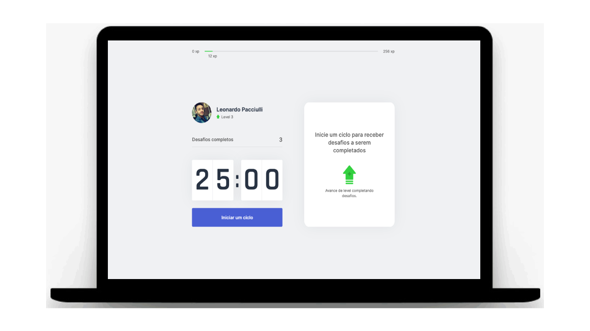

<h2 align="center">
  Next Level Week - #04 
</h2>

<p align="center">“Never Stop Learning”!</blockquote>

<br>

### 📝 About the project
Creating a countdown that will help you exercise during your work period

<div align="center">
  
</div>

<br>

## 🤖 Front-End
The Front-End was developed with Next.js / React.js / TypeScript.

<br>

## 🏁 Starting the project
Clone: `git clone https://github.com/leopacciulli/MoveIT.git`

<br>

🤖 Running
<br>Open the terminal and run the following commands:

````zsh
$ cd MoveIT

$ yarn

$ yarn start
````

---

<h3 align="center">
  Made with love by 💙 Leonardo Pacciulli
</h3>

<p align="center">
  <a href="https://www.linkedin.com/in/leonardo-pacciulli">
    
  </a>
  <a href="https://www.facebook.com/paculli">
    
  </a>
</p>
